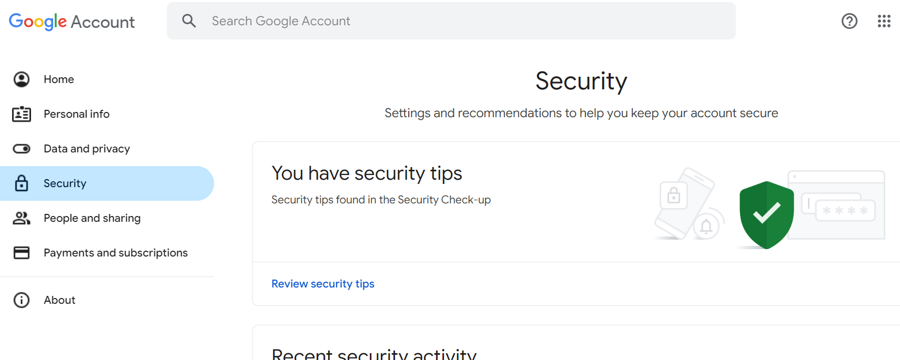
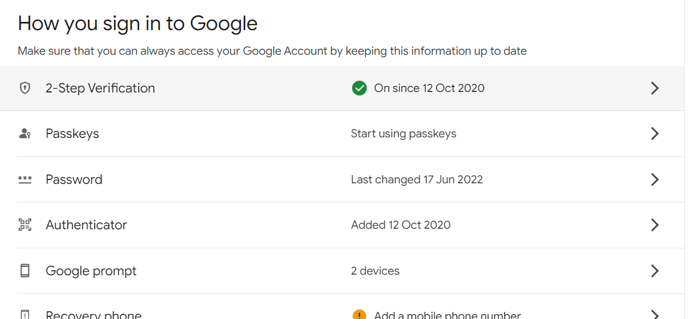
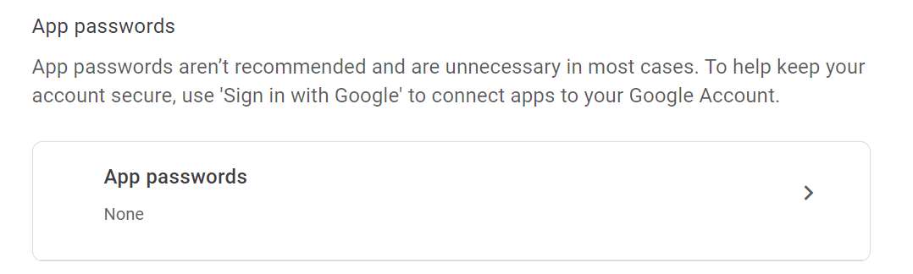
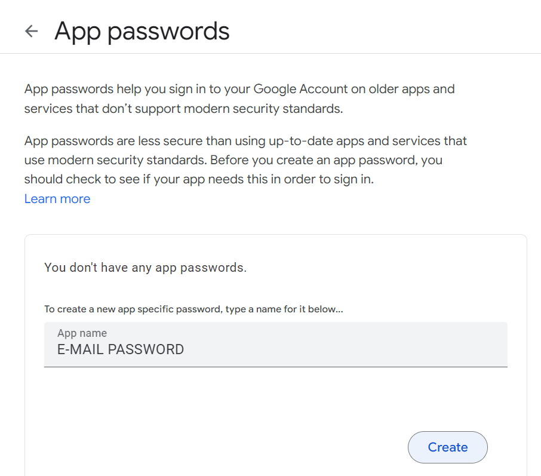
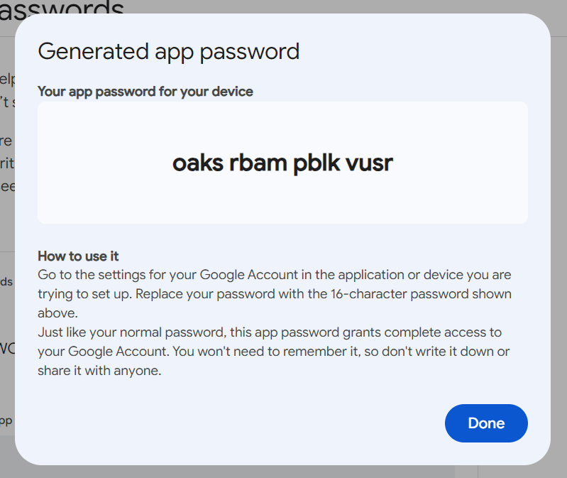
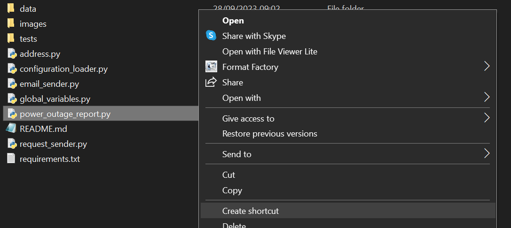
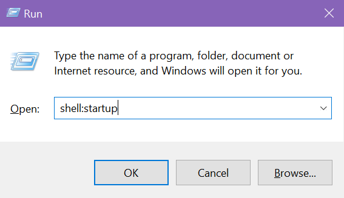
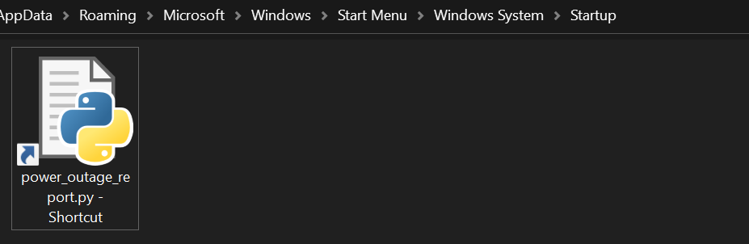

# PowerOutageReport - Tauron

## Description

PowerOutageReport allows you to configure Tauron power outage reports for selected addresses.

You can sign up for notifications on Tauron's official website, but then almost every day you will receive 
emails about power failures on a lot of streets in your area - not only on the specific 
streets that concern you.

PowerOutageReport checks recently sent emails (their number can be configured) and therefore 
only sends one failure report.

## Instructions

### 1. Installing all needed packages.
Install Python and all packages from `requirements.txt` file.

### 2. Filling in configuration file

Fill in the configuration file: `configuration.json`. You can find it in the `data` directory.

#### 2.1 Fields description

- sender_email - email address that will be used to send reports,
- sender_email_password - email password for sender_email (check *2.3 Getting password for sender email*),
- addresses - list of addresses to check,
- street_name - name of street,
- house_number - number of house / building,
- city - name of city where the street is,
- receivers_emails - list of email addresses that will receive the power outage reports.

#### 2.2 Example configuration file

```
{
  "sender_email": "sender@gmail.com",
  "sender_email_password": "passwordpassword",
  "addresses": [
    {
      "street_name": "Street1",
      "house_number": "10",
      "city": "City1",
      "receivers_emails": ["receiver@example.com"]
    },
    {
      "street_name": "Street2",
      "house_number": "20",
      "city": "City2",
      "receivers_emails": ["receiver1@example.com", "receiver2@example.com"]
    }
  ]
}
```

#### 2.3 Getting password for sender email

*Note: The domain name for sender email address should be gmail.com.*

*Note: An app password is a 16-digit passcode that gives a less secure app permission to access Google Account.
App passwords can only be used with accounts that have 2-Step Verification turned on.*

1. Go to the Google account - `Security` tab: https://myaccount.google.com/security.

    

2. Go to `How you sign in to Google` field and choose `2-Step Verification` tab.
    
    

3. Login to your account, if needed.

4. Scroll down and go to the `App passwords` section.
    
    

5. Fill in the `App name` and click `Create` button.
    
    

6. Copy generated password.
    
    

7. Paste generated password to `configuration.json` file and remove all spaces.
   
    *It should look like: `oaksrbampblkvusr`.*

### 3. Adding script to Startup Apps 

To ensure that the script runs frequently enough, it should be executed automatically.
You can add it to the `Startup Apps`, so it will be launched every time you turn on your computer.

1. Right-click on `power_outage_report.py` and choose `Create shortcut`.

   

2. Open the `Startup` directory.

   2.1 Click `Windows Key + R`. 

   2.2 In the Run window `Open` field type `shell:startup`.

   2.3 Click `OK`.

    

   *Result: The `Startup` directory is opened.*

3. Put `power_outage_report.py - Shortcut` in the `Startup` directory.

    

### 4. Additional settings

1. If you send many emails from your gmail mailbox, you can change the number of sent emails that will be checked.
   Currently, it is set to 20. This means if any of the last 20 emails was a power outage report for specific address 
   and receivers, a new message will not be generated.

   1.1 Open `email_sender.py`. 

   1.2 Change `sent_messages_number` variable to the desired number (`type: int`).
